# Omnicode Architecture & Complete End-to-End Data Flow Specification

> **Document Version:** 1.0.0  
> **Target Framework:** Next.js 16.3.1 (App Router), React 19, TypeScript, Prisma v7 (PostgreSQL Adapter), Redux Toolkit, ImageKit SDK, LinkedIn REST API v202601.

---

## Table of Contents

1. [High-Level Architecture Overview](#1-high-level-architecture-overview)
2. [Technology Stack & Library Matrix](#2-technology-stack--library-matrix)
3. [Database Schema & Entity Relational Model](#3-database-schema--entity-relational-model)
4. [Client-Side State Management (Redux Store & Custom Hooks)](#4-client-side-state-management-redux-store--custom-hooks)
5. [Complete Route-by-Route Directory & Handler Mapping](#5-complete-route-by-route-directory--handler-mapping)
6. [Detailed Function-to-Function Data Flow Diagrams & Step-by-Step Traces](#6-detailed-function-to-function-data-flow-diagrams--step-by-step-traces)
   - 6.1 [User Registration Flow (Sign Up)](#61-user-registration-flow-sign-up)
   - 6.2 [User Authentication Flow (Email/Password Sign In)](#62-user-authentication-flow-emailpassword-sign-in)
   - 6.3 [Google OAuth 2.0 & SSO Flow](#63-google-oauth-20--sso-flow)
   - 6.4 [Session Verification & Route Protection (`getCurrentUser` / `useAuthRedirect`)](#64-session-verification--route-protection-getcurrentuser--useauthredirect)
   - 6.5 [LinkedIn Account Connection (OAuth 2.0 3-Legged Auth)](#65-linkedin-account-connection-oauth-20-3-legged-auth)
   - 6.6 [Connected Accounts Discovery & Disconnection Flow](#66-connected-accounts-discovery--disconnection-flow)
   - 6.7 [Image Upload & Direct-to-CDN Flow (ImageKit SDK + HMAC Server Auth)](#67-image-upload--direct-to-cdn-flow-imagekit-sdk--hmac-server-auth)
   - 6.8 [Post Creation Flow (Instant Live Broadcast vs. Scheduled Queue)](#68-post-creation-flow-instant-live-broadcast-vs-scheduled-queue)
   - 6.9 [Cron Background Worker & Publishing Automation Engine](#69-cron-background-worker--publishing-automation-engine)
   - 6.10 [LinkedIn Publisher: 2-Step Binary Upload & Commentary Publishing](#610-linkedin-publisher-2-step-binary-upload--commentary-publishing)
   - 6.11 [Post Deletion Flow with Optimistic UI Update](#611-post-deletion-flow-with-optimistic-ui-update)
   - 6.12 [User Logout Flow](#612-user-logout-flow)
   - 6.13 [Consultation / Discovery Booking Flow](#613-consultation--discovery-booking-flow)
7. [Security, Session, and Error-Handling Architecture](#7-security-session-and-error-handling-architecture)
8. [Cross-Cutting Concerns & Production Observability](#8-cross-cutting-concerns--production-observability)

---

## 1. High-Level Architecture Overview

Omnicode is an enterprise-grade social media orchestration and automation platform designed to empower creators, brands, and agencies to create, preview, schedule, and syndicate multi-platform content (LinkedIn, with Facebook and Instagram expandability).

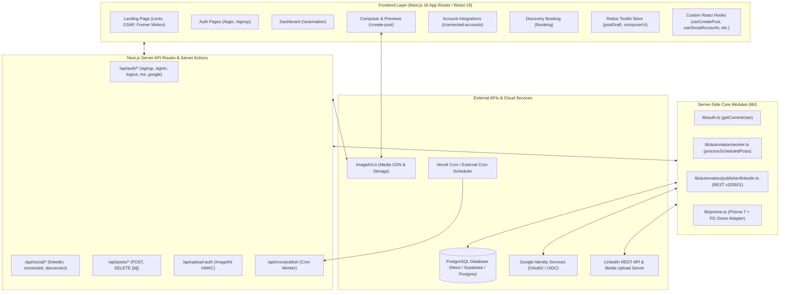

---

## 2. Technology Stack & Library Matrix

| Library / Dependency | Version | Purpose in Architecture | Key Function / Module Calls |
| :--- | :--- | :--- | :--- |
| **`next`** | `16.3.1` | Full-stack framework (App Router, Server Components, API Handlers) | `NextRequest`, `NextResponse`, `cookies()`, `redirect()`, dynamic routing |
| **`react` / `react-dom`** | `19.2.8` | UI rendering, client-side hooks, transition management | `useState`, `useEffect`, `useRef`, `useCallback` |
| **`@reduxjs/toolkit`** | `2.12.0` | Global state management for post draft data & UI composer | `configureStore`, `createSlice`, `PayloadAction` |
| **`react-redux`** | `9.3.0` | React bindings for Redux | `useDispatch.withTypes()`, `useSelector.withTypes()` |
| **`@prisma/client`** | `7.9.1` | Database ORM client (generated to `lib/generated/prisma`) | `prisma.user`, `prisma.session`, `prisma.post`, `prisma.account` |
| **`@prisma/adapter-pg`** | `7.9.1` | High-performance PostgreSQL driver adapter for Prisma 7 | `new PrismaPg({ connectionString })` |
| **`pg`** | `8.23.0` | Low-level Node PostgreSQL driver | Connection pooling and SSL connection string parsing |
| **`@imagekit/next`** | `2.1.5` | Client-side chunked file upload & server-side HMAC token generation | `upload()`, `getUploadAuthParams()`, error classes |
| **`bcryptjs`** | `3.0.3` | One-way salted password hashing | `bcrypt.hash(pwd, 12)`, `bcrypt.compare(pwd, hash)` |
| **`zod`** | `4.4.3` | Schema definition & input validation for runtime security | `safeParse()`, `z.object()`, `z.string()`, `z.enum()` |
| **`framer-motion`** | `13.1.0` | Declarative UI animations, modal transitions, mobile drawers | `motion.div`, `AnimatePresence`, `Variants` |
| **`gsap`** | `3.15.0` | High-performance landing page timeline & scroll-triggered animations | `gsap.timeline()`, `gsap.to()`, `ScrollTrigger` |
| **`lenis`** | `1.3.26` | Smooth inertial page scrolling | `new Lenis()`, RAF render loops |
| **`lucide-react`** | `1.31.0` | Monochrome, scalable vector UI icons | `LayoutDashboard`, `Trash2`, `Clock`, `Zap`, `CheckCircle2` |
| **`sonner`** | `2.0.8` | Interactive toast notifications | `toast.success()`, `toast.error()` |
| **`@radix-ui/react-alert-dialog` / `shadcn`** | `1.1.23` / `4.18.0` | Accessible dialogs and confirmation modals | `<Dialog>`, `<DialogContent>`, `<DialogHeader>` |
| **`tailwind-merge` & `clsx`** | `3.6.0` / `2.1.1` | Dynamic utility class combining & collision avoidance | `cn(...inputs)` in `lib/utils.ts` |

---

## 3. Database Schema & Entity Relational Model

The database is built on PostgreSQL with Prisma ORM 7.

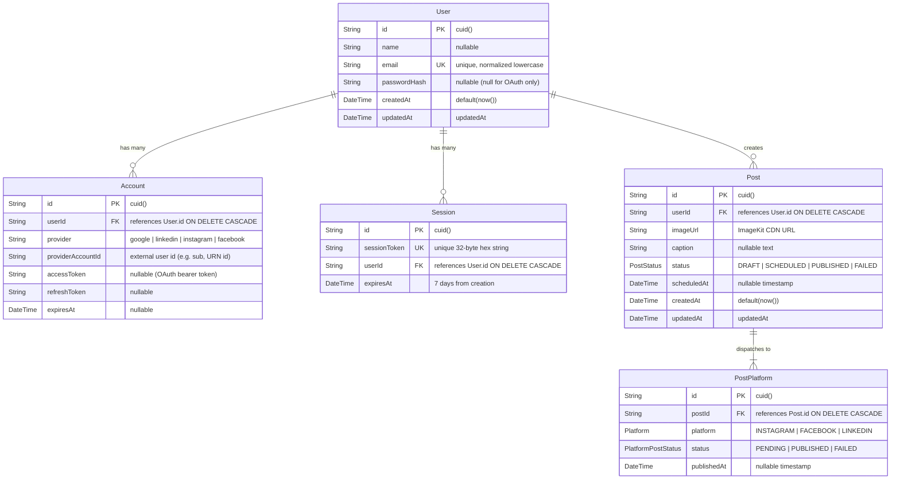

---

## 4. Client-Side State Management (Redux Store & Custom Hooks)

### 4.1 Redux Store Architecture (`lib/store.ts`)
The Redux store centralizes draft content and composer UI status:

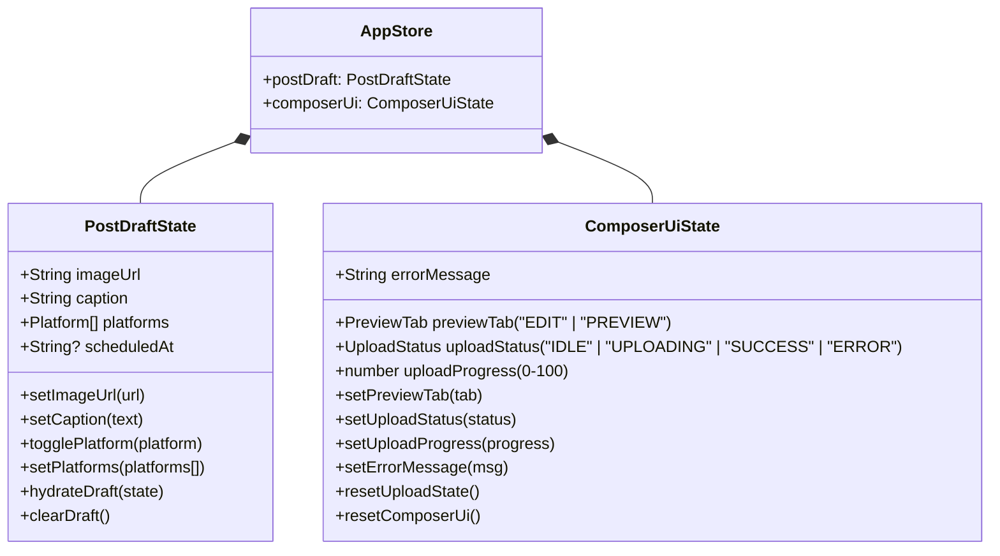

### 4.2 Custom React Hooks (`lib/hooks/`)

| Hook Name | File Location | Responsibilities | Key Functions & Returned Values |
| :--- | :--- | :--- | :--- |
| `useAuthRedirect` | [`lib/hooks/useAuthRedirect.ts`](file:///c:/Users/sibas/OneDrive/Desktop/Freelance%20Works/omnicode-beta/lib/hooks/useAuthRedirect.ts) | Queries `/api/auth/me` on mount to enforce route guarding or auto-redirection. | `{ user, loading, authenticated }` |
| `useCreatePost` | [`lib/hooks/useCreatePost.ts`](file:///c:/Users/sibas/OneDrive/Desktop/Freelance%20Works/omnicode-beta/lib/hooks/useCreatePost.ts) | Bridges Redux state to `/api/posts`, validates with Zod, handles instant vs scheduled release. | `{ creating, isScheduled, scheduleDate, scheduleTime, handlePublishNow, handleSchedulePost }` |
| `useDeletePost` | [`lib/hooks/useDeletePost.ts`](file:///c:/Users/sibas/OneDrive/Desktop/Freelance%20Works/omnicode-beta/lib/hooks/useDeletePost.ts) | Manages post deletion modal, calls `DELETE /api/posts/[id]`, performs optimistic state removal. | `{ postToDelete, deleting, openDeleteDialog, closeDeleteDialog, handleDeleteConfirm }` |
| `useSocialAccounts` | [`lib/hooks/useSocialAccounts.ts`](file:///c:/Users/sibas/OneDrive/Desktop/Freelance%20Works/omnicode-beta/lib/hooks/useSocialAccounts.ts) | Handles social network disconnects via `/api/social/disconnect` with optimistic UI update. | `{ platforms, targetDisconnect, disconnecting, promptDisconnect, cancelDisconnect, handleConfirmDisconnect }` |
| `useConnectedPlatforms` | [`lib/hooks/useConnectedPlatforms.ts`](file:///c:/Users/sibas/OneDrive/Desktop/Freelance%20Works/omnicode-beta/lib/hooks/useConnectedPlatforms.ts) | Fetches authorized platforms from `/api/social/connected` to enable/disable toggles in composer. | `{ connectedPlatforms: string[], loading: boolean }` |

---

## 5. Complete Route-by-Route Directory & Handler Mapping

```
app/
├── (landing-page)
│   ├── page.tsx                           # Landing Page with SSR auth check
│   ├── booking/page.tsx                   # Consultation Booking with Interactive Scheduler
│   ├── privacy/page.tsx                   # Privacy Policy Page
│   ├── terms/page.tsx                     # Terms of Service Page
├── login/page.tsx                         # User Login Page
├── signup/page.tsx                        # User Registration Page
├── automation/page.tsx                    # Protected Dashboard (Stats, Post History)
├── create-post/page.tsx                   # Protected Post Composer & Live Preview
├── connected-accounts/page.tsx            # Protected Social Media Connection Hub
└── api/
    ├── auth/
    │   ├── signup/route.ts                # POST: User registration with bcrypt hashing
    │   ├── signin/route.ts                # POST: Email/password auth & session cookie creation
    │   ├── logout/route.ts                # POST: Session revocation & cookie clearing
    │   ├── me/route.ts                    # GET: Session verification endpoint
    │   └── google/
    │       ├── route.ts                   # GET: Google OAuth 2.0 redirect
    │       └── callback/route.ts          # GET: Google OAuth code exchange & user provisioning
    ├── social/
    │   ├── linkedin/
    │   │   ├── route.ts                   # GET: LinkedIn 3-legged OAuth initiator
    │   │   └── callback/route.ts          # GET: LinkedIn access token exchange & account store
    │   ├── connected/route.ts             # GET: Returns user's active connected providers
    │   └── disconnect/route.ts            # POST: Unlinks and deletes social account credentials
    ├── posts/
    │   ├── route.ts                       # POST: Post creation (instant or scheduled)
    │   └── [id]/route.ts                  # DELETE: Cascading deletion of post and platforms
    ├── cron/
    │   └── publish/route.ts               # GET: Automated cron worker triggering scheduled posts
    ├── upload-auth/route.ts               # GET: ImageKit HMAC upload signature generator
    └── test/route.ts                      # GET: Test sandbox endpoint for direct LinkedIn posting
```

---

## 6. Detailed Function-to-Function Data Flow Diagrams & Step-by-Step Traces

---

### 6.1 User Registration Flow (Sign Up)

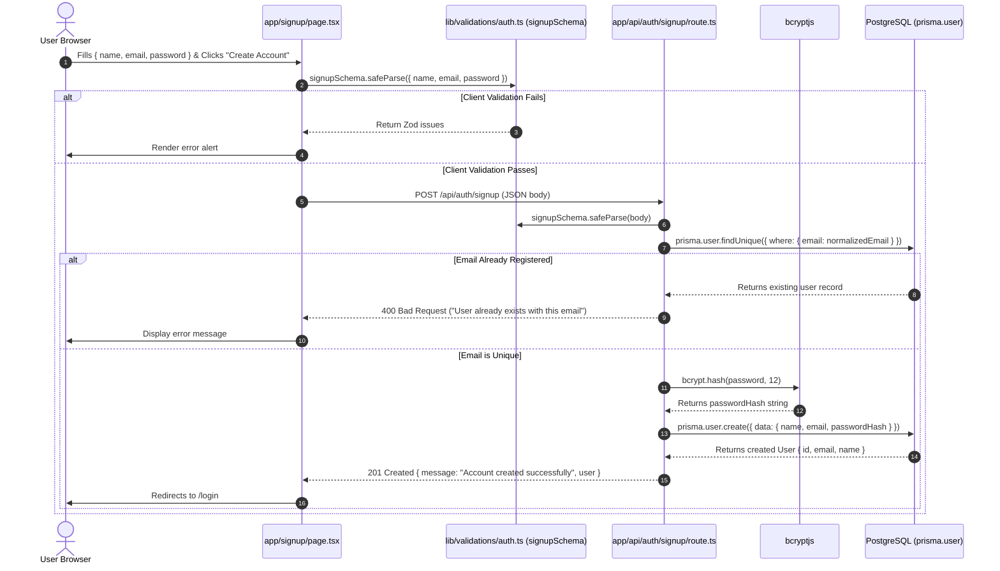

---

### 6.2 User Authentication Flow (Email/Password Sign In)

```mermaid
sequenceDiagram
    autonumber
    actor User as User Browser
    participant Page as app/login/page.tsx
    participant Schema as lib/validations/auth.ts (signinSchema)
    participant API as app/api/auth/signin/route.ts
    participant DB as PostgreSQL (prisma.user & prisma.session)
    participant Crypto as Node crypto
    participant Bcrypt as bcryptjs

    User->>Page: Enters { email, password } & Clicks "Sign In"
    Page->>Schema: signinSchema.safeParse({ email, password })
    Page->>API: POST /api/auth/signin (JSON body)
    API->>Schema: signinSchema.safeParse(body)
    API->>DB: prisma.user.findUnique({ where: { email: normalizedEmail } })
    
    alt User Not Found or No PasswordHash (e.g., OAuth-only account)
        DB-->>API: null or empty passwordHash
        API-->>Page: 401 Unauthorized ("Invalid email or password")
    else User Exists
        API->>Bcrypt: bcrypt.compare(password, user.passwordHash)
        alt Password Mismatch
            Bcrypt-->>API: false
            API-->>Page: 401 Unauthorized ("Invalid email or password")
        else Password Matches
            Bcrypt-->>API: true
            API->>Crypto: crypto.randomBytes(32).toString('hex')
            Crypto-->>API: sessionToken (64 hex chars)
            API->>DB: prisma.session.create({ data: { sessionToken, userId, expiresAt: now + 7 days } })
            DB-->>API: Session created
            API-->>Page: 200 OK + Set-Cookie: session_token=<token>; HttpOnly; SameSite=Lax; Path=/
            Page->>User: Redirects to /automation
        end
    end
```

---

### 6.3 Google OAuth 2.0 & SSO Flow

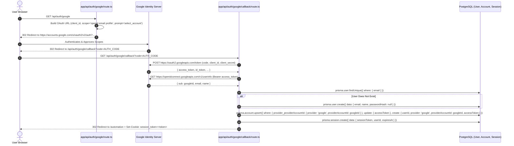

---

### 6.4 Session Verification & Route Protection (`getCurrentUser` / `useAuthRedirect`)

```mermaid
sequenceDiagram
    autonumber
    participant ClientHook as lib/hooks/useAuthRedirect.ts
    participant API as app/api/auth/me/route.ts
    participant AuthLib as lib/auth.ts (getCurrentUser)
    participant NextCookie as Next.js cookies()
    participant DB as PostgreSQL (prisma.session)

    ClientHook->>API: GET /api/auth/me
    API->>AuthLib: getCurrentUser()
    AuthLib->>NextCookie: cookieStore.get("session_token")
    alt No Cookie Present
        AuthLib-->>API: null
        API-->>ClientHook: 401 Unauthorized { authenticated: false, user: null }
        ClientHook->>ClientHook: Redirect to redirectToIfUnauthenticated (if configured)
    else Cookie Present
        AuthLib->>DB: prisma.session.findUnique({ where: { sessionToken }, include: { user: true } })
        alt Session Not In DB
            DB-->>AuthLib: null
            AuthLib-->>API: null
            API-->>ClientHook: 401 Unauthorized { authenticated: false, user: null }
        else Session Expired (expiresAt < now)
            AuthLib->>DB: prisma.session.delete({ where: { id: session.id } })
            AuthLib-->>API: null
            API-->>ClientHook: 401 Unauthorized { authenticated: false, user: null }
        else Session Active
            AuthLib-->>API: session.user
            API-->>ClientHook: 200 OK { authenticated: true, user: { id, email, name } }
        end
    end
```

---

### 6.5 LinkedIn Account Connection (OAuth 2.0 3-Legged Auth)

```mermaid
sequenceDiagram
    autonumber
    actor User as User Browser
    participant LinkedInInit as app/api/social/linkedin/route.ts
    participant LinkedInOAuth as LinkedIn Identity Platform
    participant LinkedInCallback as app/api/social/linkedin/callback/route.ts
    participant AuthLib as lib/auth.ts (getCurrentUser)
    participant DB as PostgreSQL (prisma.account)

    User->>LinkedInInit: GET /api/social/linkedin
    LinkedInInit->>AuthLib: getCurrentUser() (verifies user session)
    LinkedInInit->>LinkedInInit: Generate crypto state token (16 bytes hex)
    LinkedInInit-->>User: 302 Redirect to https://www.linkedin.com/oauth/v2/authorization?... + Set-Cookie: linkedin_oauth_state=<state>; maxAge=600s
    User->>LinkedInOAuth: Approves LinkedIn Social Permissions (`w_member_social`, `openid`, `profile`, `email`)
    LinkedInOAuth-->>User: 302 Redirect to /api/social/linkedin/callback?code=CODE&state=STATE
    User->>LinkedInCallback: GET /api/social/linkedin/callback?code=CODE&state=STATE
    LinkedInCallback->>LinkedInCallback: Verify query state matches cookie `linkedin_oauth_state`
    LinkedInCallback->>AuthLib: Verify active `session_token` cookie
    LinkedInCallback->>LinkedInOAuth: POST https://www.linkedin.com/oauth/v2/accessToken (code, client_id, client_secret, redirect_uri)
    LinkedInOAuth-->>LinkedInCallback: { access_token, expires_in }
    LinkedInCallback->>LinkedInOAuth: GET https://api.linkedin.com/v2/userinfo (Bearer access_token)
    LinkedInOAuth-->>LinkedInCallback: { sub: linkedinMemberId, name, email }
    LinkedInCallback->>DB: prisma.account.upsert({ where: { provider_providerAccountId: { provider: 'linkedin', providerAccountId: linkedinMemberId } }, update: { userId, accessToken, expiresAt }, create: { userId, provider: 'linkedin', providerAccountId: linkedinMemberId, accessToken, expiresAt } })
    LinkedInCallback-->>User: 302 Redirect to /connected-accounts?linkedin=connected + Clear Cookie: linkedin_oauth_state
```

---

### 6.6 Connected Accounts Discovery & Disconnection Flow

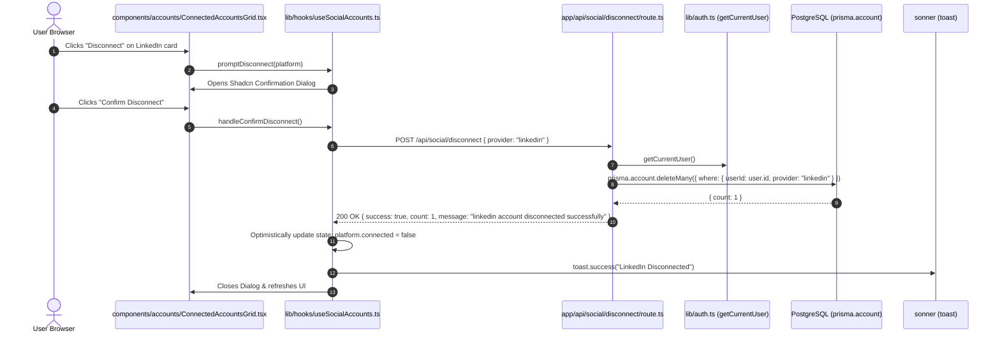

---

### 6.7 Image Upload & Direct-to-CDN Flow (ImageKit SDK + HMAC Server Auth)

```mermaid
sequenceDiagram
    autonumber
    actor User as User Browser
    participant Composer as app/create-post/page.tsx
    participant Redux as Redux Store (composerUi & postDraft)
    participant UploadAuthAPI as app/api/upload-auth/route.ts
    participant ImageKitServer as @imagekit/next/server (getUploadAuthParams)
    participant ImageKitClient as @imagekit/next (upload)
    participant ImageKitCDN as ImageKit.io Cloud Storage

    User->>Composer: Selects image file in `<input type="file" />`
    Composer->>Redux: dispatch(setUploadStatus("UPLOADING")), dispatch(setUploadProgress(0))
    Composer->>UploadAuthAPI: GET /api/upload-auth
    UploadAuthAPI->>UploadAuthAPI: getCurrentUser()
    UploadAuthAPI->>ImageKitServer: getUploadAuthParams({ privateKey, publicKey })
    ImageKitServer-->>UploadAuthAPI: { token, expire, signature, publicKey }
    UploadAuthAPI-->>Composer: 200 OK { token, expire, signature, publicKey }
    
    Composer->>ImageKitClient: upload({ file, fileName, token, signature, expire, publicKey, folder: "/social-manager", onProgress })
    loop Upload Chunks
        ImageKitClient->>ImageKitCDN: Stream binary chunks
        ImageKitClient->>Composer: onProgress(event: { loaded, total })
        Composer->>Redux: dispatch(setUploadProgress(percent))
    end
    ImageKitCDN-->>ImageKitClient: { url: "https://ik.imagekit.io/...", fileId: "..." }
    ImageKitClient-->>Composer: result { url }
    Composer->>Redux: dispatch(setImageUrl(result.url)), dispatch(setUploadStatus("SUCCESS"))
    Composer->>User: Displays image in composer & device live preview
```

---

### 6.8 Post Creation Flow (Instant Live Broadcast vs. Scheduled Queue)

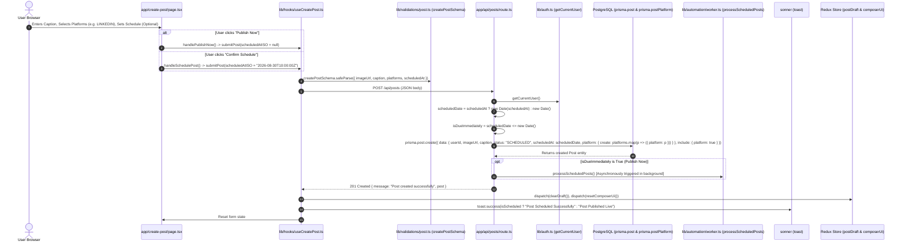

---

### 6.9 Cron Background Worker & Publishing Automation Engine

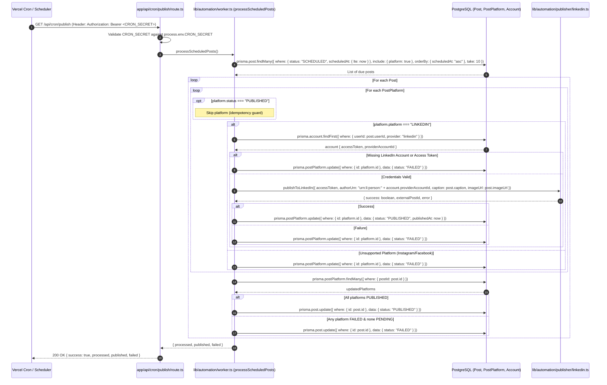

---

### 6.10 LinkedIn Publisher: 2-Step Binary Upload & Commentary Publishing

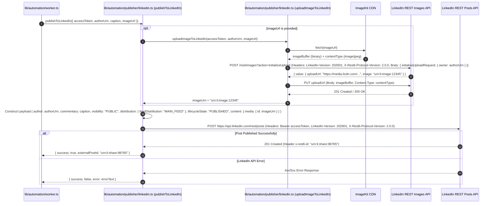

---

### 6.11 Post Deletion Flow with Optimistic UI Update

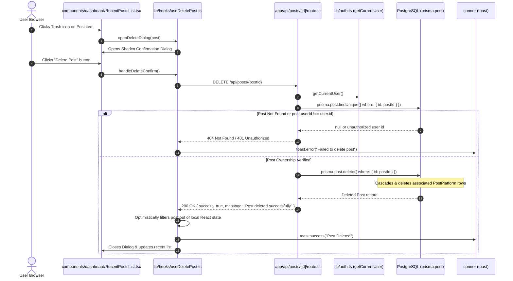

---

### 6.12 User Logout Flow

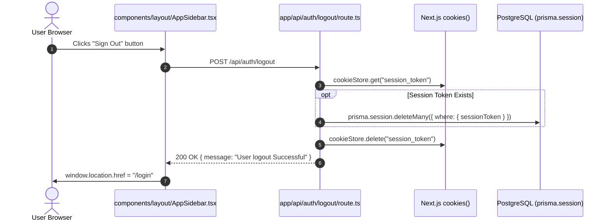

---

### 6.13 Consultation / Discovery Booking Flow

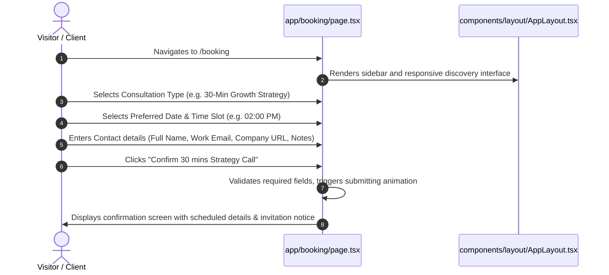

---

## 7. Security, Session, and Error-Handling Architecture

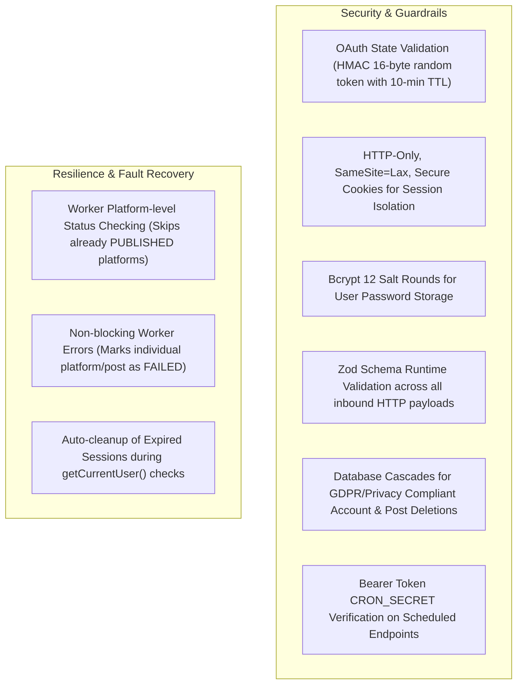

1. **Authentication Token Lifecycle:**
   - Generated via Node.js native `crypto.randomBytes(32).toString("hex")`.
   - Stored in the PostgreSQL `Session` table with an explicit 7-day expiration timestamp (`expiresAt`).
   - Transported via HTTP-Only, Lax-same-site cookie (`session_token`).
   - Auto-purged from the database upon expiration during `getCurrentUser()` validation checks.

2. **OAuth 2.0 Security:**
   - **LinkedIn & Google:** Employs cryptographically secure `state` parameters stored in temporary cookies (`linkedin_oauth_state`) with 10-minute maximum age to block Cross-Site Request Forgery (CSRF).
   - **Secret Isolation:** Environment variables (`GOOGLE_CLIENT_SECRET`, `LINKEDIN_CLIENT_SECRET`, `IMAGEKIT_PRIVATE_KEY`, `CRON_SECRET`) are strictly read in server-side handlers and never exposed to the client bundle.

3. **Input Validation:**
   - All mutations pass through strict Zod schemas (`signupSchema`, `signinSchema`, `createPostSchema`).
   - Invalid payloads receive structured 400 responses containing mapped error messages.

---

## 8. Cross-Cutting Concerns & Production Observability

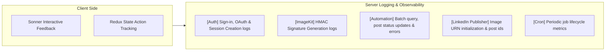

- **Structured Console Logging:** Every automated worker run outputs detailed progress:
  - `[Automation] Looking for scheduled posts at <ISO timestamp>`
  - `[Automation] Processing post <id>`
  - `[LinkedIn Image] Image uploaded successfully. URN: <urn>`
  - `[Automation] Finished. Processed: X, Published: Y, Failed: Z`
- **Database Indexing:** Unique compound indexes on `[provider, providerAccountId]`, `[postId, platform]`, and single-key indexes on `sessionToken` and `email` ensure high query throughput.
- **Client Cache Synchronization:** Custom hooks execute `router.refresh()` in conjunction with optimistic UI state mutations to ensure the Next.js server component cache stays in lockstep with the database.

---
*End of Data Flow Specification.*
