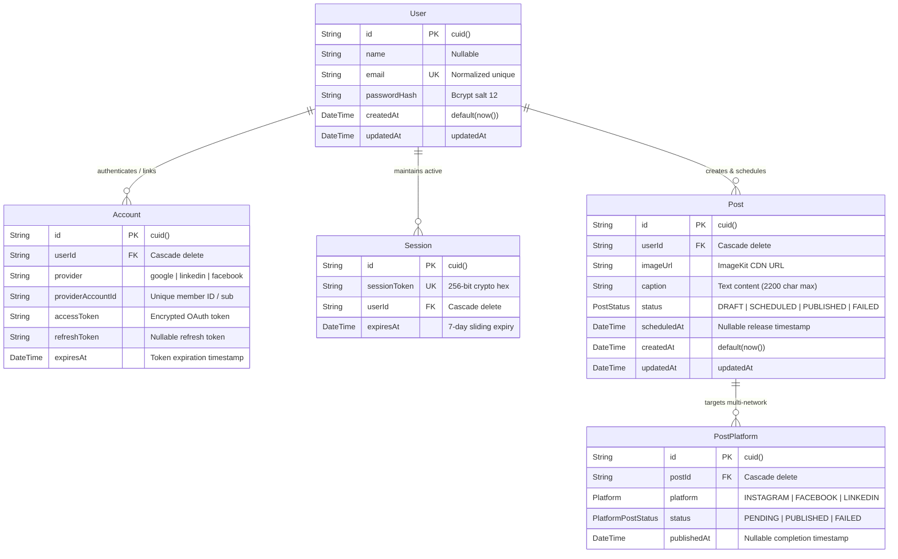
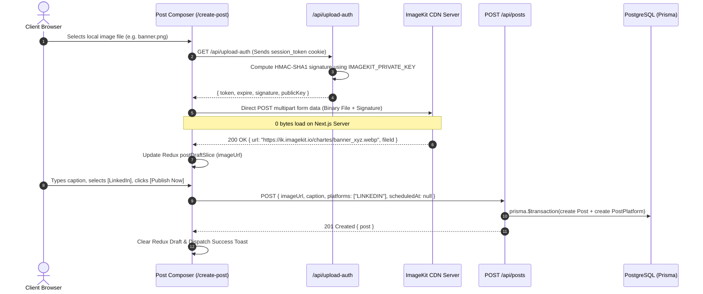
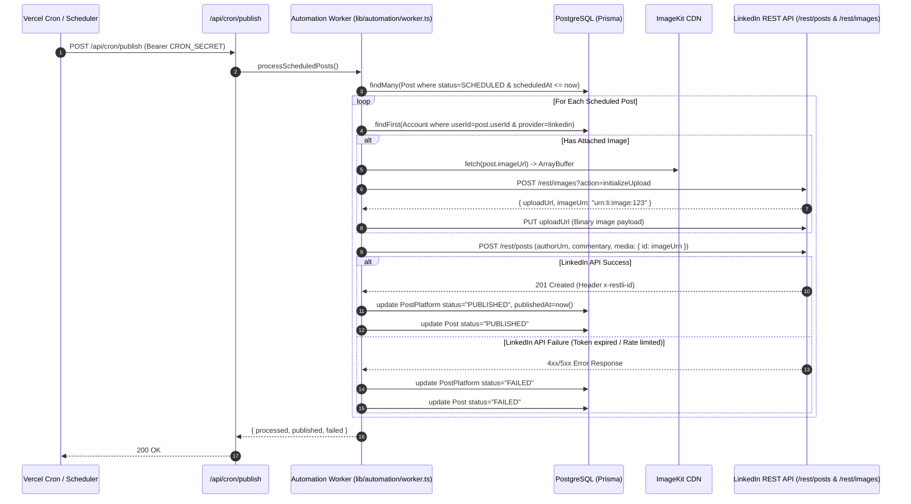
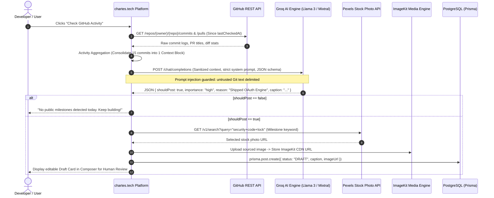
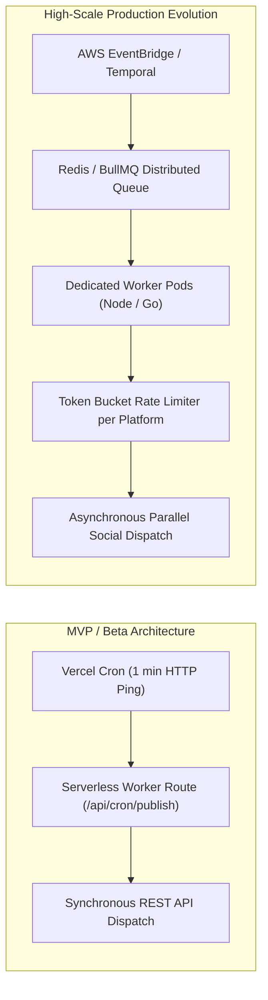

# 🏛️ System Design & Architectural Decisions — chartes.tech (`omnicode-beta`)

> **Document Type:** System Design Document & Architectural Decision Record (ADR)  
> **Project:** `chartes.tech` (Social Media Marketing Automation & "Build in Public" AI Engine)  
> **Last Updated:** August 2026  
> **Target Audience:** Software Architects, Full-Stack Engineers, System Designers, Technical Interviewers

---

## 📌 Table of Contents

1. [Executive Summary & System Goals](#1-executive-summary--system-goals)
2. [High-Level Architecture & Component Topology](#2-high-level-architecture--component-topology)
3. [Core Architectural Decisions & Trade-Off Matrix (ADRs)](#3-core-architectural-decisions--trade-off-matrix-adrs)
   - [ADR-001: Next.js 16 App Router & Full-Stack Monorepo](#adr-001-nextjs-16-app-router--full-stack-monorepo)
   - [ADR-002: PostgreSQL + Prisma 7 with Driver Adapter Singleton](#adr-002-postgresql--prisma-7-with-driver-adapter-singleton)
   - [ADR-003: Custom Cryptographic Session Auth vs Stateless JWT](#adr-003-custom-cryptographic-session-auth-vs-stateless-jwt)
   - [ADR-004: Direct-to-CDN Media Storage (ImageKit Signed Token Handshake)](#adr-004-direct-to-cdn-media-storage-imagekit-signed-token-handshake)
   - [ADR-005: Two-Tier State Management (Redux Store Factory + Persistence)](#adr-005-two-tier-state-management-redux-store-factory--persistence)
   - [ADR-006: Parent-Child Platform Publishing State Machine & Idempotency](#adr-006-parent-child-platform-publishing-state-machine--idempotency)
   - [ADR-007: Cron Dispatch & Worker Isolation Model](#adr-007-cron-dispatch--worker-isolation-model)
   - [ADR-008: Bounded AI Pipeline & Human-in-the-Loop Content Generation](#adr-008-bounded-ai-pipeline--human-in-the-loop-content-generation)
4. [Data Architecture & Entity Relationship Model (ERD)](#4-data-architecture--entity-relationship-model-erd)
5. [End-to-End System Sequence Flows](#5-end-to-end-system-sequence-flows)
   - [Flow 1: Authentication & Session Issuance Lifecycle](#flow-1-authentication--session-issuance-lifecycle)
   - [Flow 2: OAuth 2.0 Social Account Linking (LinkedIn / Google)](#flow-2-oauth-20-social-account-linking-linkedin--google)
   - [Flow 3: Client Direct Media Upload & Post Composition](#flow-3-client-direct-media-upload--post-composition)
   - [Flow 4: Background Scheduling Worker & 2-Step Binary Publishing](#flow-4-background-scheduling-worker--2-step-binary-publishing)
   - [Flow 5: Build-in-Public AI Milestone Discovery Engine](#flow-5-build-in-public-ai-milestone-discovery-engine)
6. [API Interface & Network Contract](#6-api-interface--network-contract)
7. [Frontend Architecture & Design System](#7-frontend-architecture--design-system)
8. [Security, Governance & Data Protection](#8-security-governance--data-protection)
9. [Scalability Bottlenecks, Failure Modes & Future Roadmap](#9-scalability-bottlenecks-failure-modes--future-roadmap)

---

## 1. Executive Summary & System Goals

`chartes.tech` is a cloud-native, multi-platform social automation and marketing engine designed to solve the friction of manual cross-network publishing, milestone tracking, and social media scheduling for developers, creators, and agencies.

```
┌────────────────────────────────────────────────────────────────────────┐
│                          Core System Objectives                        │
├───────────────────────────────────┬────────────────────────────────────┤
│ 1. Unified Distribution           │ Draft once, publish to LinkedIn,   │
│                                   │ Meta (FB/IG), and X.               │
├───────────────────────────────────┼────────────────────────────────────┤
│ 2. Automated Scheduled Release    │ Reliable, time-accurate background │
│                                   │ delivery via idempotent workers.   │
├───────────────────────────────────┼────────────────────────────────────┤
│ 3. Zero-Server-Memory Uploads     │ Direct-to-CDN signed token flow.   │
├───────────────────────────────────┼────────────────────────────────────┤
│ 4. "Build in Public" AI Pipeline  │ Git activity → AI Milestone filter │
│                                   │ → Sourced Imagery → Human Draft.   │
├───────────────────────────────────┼────────────────────────────────────┤
│ 5. Enterprise Security & Privacy  │ Strict OAuth state verification,   │
│                                   │ HTTP-only cookies, GDPR compliance.│
└───────────────────────────────────┴────────────────────────────────────┘
```

---

## 2. High-Level Architecture & Component Topology

```mermaid
graph TB
    subgraph Client Tier ["Client Tier (Browser / Mobile)"]
        UI["React 19 / Next.js 16 Client Components"]
        Redux["Redux Toolkit (postDraft + composerUi)"]
        Lenis["Lenis Smooth Scroll + GSAP + OGL WebGL"]
        Sonner["Sonner Toast Feedback System"]
    end

    subgraph CDN & Media ["CDN & Media Acceleration"]
        IK["ImageKit.io CDN & Media Optimizer"]
    end

    subgraph Backend Tier ["Application & API Tier (Next.js 16 App Router)"]
        RSC["React Server Components (Auth Guards & SSR)"]
        RouteHandlers["Next.js Route Handlers (/api/*)"]
        ZodLayer["Zod Validation Schema Engine"]
        AuthHelper["Session Auth Engine (getCurrentUser)"]
        Worker["Automation Worker (processScheduledPosts)"]
    end

    subgraph Data Tier ["Database Tier (PostgreSQL)"]
        NeonDB[("Neon Serverless PostgreSQL")]
        PrismaORM["Prisma 7 ORM (@prisma/adapter-pg)"]
    end

    subgraph Cron Engine ["Trigger Engine"]
        VercelCron["Vercel Cron / External Dispatcher"]
    end

    subgraph External Platforms ["External APIs & Networks"]
        GoogleOAuth["Google OAuth 2.0 / OIDC"]
        LinkedInAPI["LinkedIn REST API (v202601 + Images API)"]
        MetaGraph["Meta Graph API (Facebook / Instagram)"]
        GroqAI["Groq AI LLM Engine (Llama 3 / Mixtral)"]
        PexelsAPI["Pexels Stock Image API"]
    end

    %% Client Interactions
    UI -->|1. Render & Navigate| RSC
    UI -->|2. Local Draft Persistence| Redux
    UI -->|3. Get Upload Auth Token| RouteHandlers
    UI -->|4. Direct Binary Image Upload| IK
    UI -->|5. Post Creation & Mutate| RouteHandlers

    %% Backend Interactions
    RSC --> AuthHelper
    RouteHandlers --> ZodLayer
    ZodLayer --> AuthHelper
    AuthHelper --> PrismaORM
    PrismaORM --> NeonDB

    %% Auth & Social Integrations
    RouteHandlers -->|OAuth Handshake| GoogleOAuth
    RouteHandlers -->|OAuth Handshake| LinkedInAPI

    %% Worker Automation
    VercelCron -->|Bearer CRON_SECRET| RouteHandlers
    RouteHandlers -->|Trigger| Worker
    Worker --> PrismaORM
    Worker -->|Fetch image asset| IK
    Worker -->|2-Step Media Upload & Post| LinkedInAPI
    Worker -.->|Future Integration| MetaGraph

    %% AI Pipeline
    Worker -.->|Milestone Classification| GroqAI
    Worker -.->|Contextual Image Sourcing| PexelsAPI
```



---

## 3. Core Architectural Decisions & Trade-Off Matrix (ADRs)

### ADR-001: Next.js 16 App Router & Full-Stack Monorepo

* **Context:** Choosing between a split architecture (Single Page App on Vite + Standalone Express/NestJS backend) versus a unified Next.js 16 App Router full-stack monolith.
* **Decision:** Next.js 16 App Router with React Server Components (RSC) and Route Handlers.
* **Rationale:**
  1. **Server-Side Session Guarding:** Route access and dashboard rendering happen on the server (`getCurrentUser()`), completely eliminating layout shift and client-side auth waterfall flashes.
  2. **Colocation of Types & Logic:** Zod schemas, Prisma types, and API contracts share exact TypeScript types across client forms and server endpoints.
  3. **Zero Cold-Start Overhead:** Route handlers run as standard Node.js serverless functions without microservice orchestration complexity.
* **Trade-offs Considered:**
  * *Downside:* Long-running background processes cannot stay alive permanently in serverless lambdas.
  * *Resolution:* Background operations are designed as idempotent worker sweeps triggered via lightweight HTTP cron pings (`/api/cron/publish`).

---

### ADR-002: PostgreSQL + Prisma 7 with Driver Adapter Singleton

* **Context:** Data storage choice between Document-oriented (MongoDB) vs Relational (PostgreSQL) and ORM selection (Prisma 7 vs Drizzle vs Raw SQL).
* **Decision:** Neon Serverless PostgreSQL with Prisma ORM 7 utilizing `@prisma/adapter-pg`.
* **Rationale:**
  1. **Relational Integrity:** Social posts, platform delivery tracking (`PostPlatform`), user accounts (`Account`), and sessions (`Session`) demand strict foreign keys, cascade deletes, and unique compound constraints (e.g. `@@unique([postId, platform])`, `@@unique([provider, providerAccountId])`).
  2. **Prisma 7 Driver Adapter Architecture:** Prisma 7 utilizes direct JavaScript driver adapters (`@prisma/adapter-pg` over native `pg` pool) for connection reuse, eliminating Rust query engine binary boot latency in serverless environments.
  3. **Global Singleton Caching:** Prevents connection pool exhaustion in Next.js development hot-reloading:
     ```typescript
     const globalForPrisma = globalThis as unknown as { prisma: PrismaClient | undefined };
     export const prisma = globalForPrisma.prisma ?? new PrismaClient({ adapter });
     if (process.env.NODE_ENV !== "production") globalForPrisma.prisma = prisma;
     ```

---

### ADR-003: Custom Cryptographic Session Auth vs Stateless JWT

* **Context:** Selecting between stateless JWTs stored in browser `localStorage` / cookies vs database-backed cryptographic session tokens vs third-party auth services (NextAuth/Clerk).
* **Decision:** Custom server-managed session tokens stored in `HTTP-Only`, `SameSite: Lax`, `Secure` cookies backed by PostgreSQL `Session` records.
* **Rationale:**
  1. **Immediate Revocation & Security:** Stateless JWTs cannot be instantly revoked without complex distributed token blacklists. With database-backed sessions, logging out or deleting a compromised session invalidates access in $O(1)$ time.
  2. **XSS Immunity:** Storing tokens in `HTTP-Only` cookies prevents client-side malicious JavaScript from reading user credentials.
  3. **SSO Decoupling:** Users can sign in with Google OAuth without coupling their primary identity to social publishing channels. Disconnecting a LinkedIn account will never inadvertently lock a user out of their login.
  4. **Cryptographic Entropy:** Generated with `crypto.randomBytes(32).toString("hex")` (256 bits of entropy), making brute-force guessing mathematically impossible.

---

### ADR-004: Direct-to-CDN Media Storage (ImageKit Signed Token Handshake)

* **Context:** Handling user-uploaded image attachments for social posts without bottlenecking the Next.js API server.
* **Decision:** Client-side direct upload to ImageKit via signed authorization tokens (`/api/upload-auth`).
* **Architecture Comparison:**

```
Traditional Server-Proxied Upload:
[Client] ──(Multi-part 15MB)──► [Next.js Server (High Memory/Bandwidth)] ──► [S3/CDN]
                                 ❌ Server CPU Spikes
                                 ❌ 4.5MB Serverless Payload Limits

Direct-to-CDN Signed Token Flow (chartes.tech):
[Client] ──(GET /api/upload-auth)──► [Next.js Server (Issues HMAC Signature)]
   │
   └───────(Direct Binary Stream)───► [ImageKit CDN Engine]
                                      ✅ 0 bytes transferred through server
                                      ✅ Real-time client progress bar
                                      ✅ Real-time WebP/AVIF auto-transcoding
```

---

### ADR-005: Two-Tier State Management (Redux Store Factory + Persistence)

* **Context:** Managing rich draft editing state (captions, images, platform checkboxes, upload progress) across route navigations, page reloads, and server rendering.
* **Decision:** Redux Toolkit with per-request store factory (`makeStore()`) paired with domain vs transient UI slicing and `localStorage` hydration.
* **Rationale:**
  1. **SSR Isolation:** In Next.js App Router, global singleton stores leak state across different concurrent user requests. `makeStore()` instantiates a fresh store per client render.
  2. **Separation of Concerns:**
     * `postDraftSlice`: Persistent domain data (`imageUrl`, `caption`, `platforms`, `scheduledAt`). Synchronized to `localStorage` key `social-manager-post-draft`.
     * `composerUiSlice`: Transient presentation state (`previewTab`, `uploadStatus`, `uploadProgress`, `errorMessage`). Never persisted to storage.

---

### ADR-006: Parent-Child Platform Publishing State Machine & Idempotency

* **Context:** A single user post may target multiple platforms (e.g. LinkedIn + Instagram + Facebook). If one network fails, the entire post must not fail blindly, nor should successful networks be reposted upon retry.
* **Decision:** Granular relational state machine using `Post` (Parent) and `PostPlatform` (Child) entities.
* **State Machine Rules:**
  1. `PostPlatform.status` is tracked individually per network (`PENDING`, `PUBLISHED`, `FAILED`).
  2. When the automation worker runs:
     * It queries `Post` records where `status = "SCHEDULED"` and `scheduledAt <= now()`.
     * It iterates through child `PostPlatform` records. **Any platform with `status === "PUBLISHED"` is skipped.**
  3. Parent `Post` status calculation:
     $$\text{Status} = \begin{cases} 
     \text{PUBLISHED} & \text{if } \forall p \in \text{Platforms}, p.\text{status} = \text{PUBLISHED} \\ 
     \text{FAILED} & \text{if } \exists p \in \text{Platforms}, p.\text{status} = \text{FAILED} \land \forall p, p.\text{status} \neq \text{PENDING} \\ 
     \text{SCHEDULED} & \text{otherwise (partially pending)}
     \end{cases}$$

---

### ADR-007: Cron Dispatch & Worker Isolation Model

* **Context:** Triggering background publishing in a serverless environment without maintaining costly 24/7 standalone worker servers for early-stage MVP.
* **Decision:** Protected HTTP Cron Endpoint (`POST /api/cron/publish`) triggered by Vercel Cron or external schedulers.
* **Security & Failure Isolation:**
  * **Timing Attack Resistant Secret:** Guarded with `Authorization: Bearer <CRON_SECRET>` header.
  * **Batch Throttling:** Worker pulls batches of 10 posts (`take: 10`) ordered by `scheduledAt: "asc"` to prevent serverless execution timeouts (10-15s window).
  * **Fail-Safe Catch Blocks:** Unhandled network exceptions automatically mark the post as `FAILED` to prevent infinite execution loops on poisoned records.

---

### ADR-008: Bounded AI Pipeline & Human-in-the-Loop Content Generation

* **Context:** Preventing automated AI spam, hallucinations, and unverified social posts when parsing development activity (commits/PRs).
* **Decision:** Human-in-the-Loop (HITL) architecture where AI acts strictly as a bounded classification and drafting filter, never as an autonomous publisher.
* **Pipeline Rules:**
  1. **Prompt Injection Defense:** Untrusted repository commit messages and PR bodies are passed inside strict delimiters with explicit system instructions to ignore instructions inside commit text.
  2. **Zod Structured Schema Output:** AI output must validate against `{ shouldPost: boolean, importance: "low" | "medium" | "high", reason: string }`.
  3. **Conservative Default:** If parsing fails or output is ambiguous, default to `shouldPost = false`.
  4. **Draft-Only Creation:** Generated output is saved strictly as `PostStatus.DRAFT`. A human user must review, edit, and click "Publish" or "Schedule".

---

## 4. Data Architecture & Entity Relationship Model (ERD)



### Key Database Indexes & Constraints
* `User.email` — `UNIQUE` index for $O(1)$ credential lookup.
* `Session.sessionToken` — `UNIQUE` index for high-throughput authentication verification.
* `Account.[provider, providerAccountId]` — Compound `UNIQUE` index preventing duplicate OAuth account bindings.
* `PostPlatform.[postId, platform]` — Compound `UNIQUE` constraint ensuring a single post cannot declare duplicate targets for the same network.
* `Post.scheduledAt + Post.status` — Composite index path for efficient chronological worker querying.

---

## 5. End-to-End System Sequence Flows

### Flow 1: Authentication & Session Issuance Lifecycle

```mermaid
sequenceDiagram
    autonumber
    actor User as Client Browser
    participant API as /api/auth/signin
    participant Zod as Auth Zod Validator
    participant DB as PostgreSQL (Prisma)
    participant Crypto as Node.js Crypto

    User->>API: POST { email, password }
    API->>Zod: Validate email format & password constraints
    alt Invalid Schema
        Zod-->>API: ValidationError
        API-->>User: 400 Bad Request { error }
    end
    API->>DB: prisma.user.findUnique({ email })
    alt User not found / Invalid Password
        API-->>User: 401 Unauthorized "Invalid credentials"
    end
    API->>Crypto: crypto.randomBytes(32).toString('hex')
    API->>DB: prisma.session.create({ sessionToken, userId, expiresAt: now + 7d })
    API->>User: Set-Cookie: session_token=...; HttpOnly; SameSite=Lax; Path=/
    API-->>User: 200 OK { success: true, user }
```

---

### Flow 2: OAuth 2.0 Social Account Linking (LinkedIn / Google)

```mermaid
sequenceDiagram
    autonumber
    actor User as Client Browser
    participant API as /api/social/linkedin
    participant Cookie as Cookie Jar
    participant OAuth as LinkedIn OAuth Authorization Server
    participant Callback as /api/social/linkedin/callback
    participant DB as PostgreSQL (Prisma)

    User->>API: GET /api/social/linkedin (Auth required)
    API->>API: Generate 16-byte random CSRF state token
    API->>Cookie: Set-Cookie: linkedin_oauth_state=state; HttpOnly; Max-Age=600
    API-->>User: 302 Redirect to LinkedIn OAuth Consent Screen
    User->>OAuth: Authorize application scopes (w_member_social, openid, profile)
    OAuth-->>User: 302 Redirect to /api/social/linkedin/callback?code=CODE&state=STATE
    User->>Callback: GET /callback?code=CODE&state=STATE
    Callback->>Cookie: Read linkedin_oauth_state
    alt State Mismatch / Missing State
        Callback-->>User: 400 Bad Request "Invalid OAuth state"
    end
    Callback->>OAuth: POST /oauth/v2/accessToken (Exchange code + client_secret)
    OAuth-->>Callback: { access_token, expires_in }
    Callback->>OAuth: GET /v2/userinfo (Bearer access_token)
    OAuth-->>Callback: { sub: "memberId123", name, email }
    Callback->>DB: prisma.account.upsert({ provider: "linkedin", providerAccountId: sub, accessToken })
    Callback->>Cookie: Clear linkedin_oauth_state cookie
    Callback-->>User: 302 Redirect to /connected-accounts?linkedin=connected
```

---

### Flow 3: Client Direct Media Upload & Post Composition



---

### Flow 4: Background Scheduling Worker & 2-Step Binary Publishing



---

### Flow 5: Build-in-Public AI Milestone Discovery Engine



---

## 6. API Interface & Network Contract

| Method | Endpoint | Auth Required | Purpose | Payload Summary | Response Summary |
|---|---|---|---|---|---|
| `POST` | `/api/auth/signup` | No | Register new user account | `{ name, email, password }` | `201 Created` `{ user: { id, email } }` |
| `POST` | `/api/auth/signin` | No | Authenticate & issue session cookie | `{ email, password }` | `200 OK` (Sets `session_token` cookie) |
| `POST` | `/api/auth/logout` | Yes | Destroy active session record | None | `200 OK` (Clears `session_token` cookie) |
| `GET` | `/api/auth/me` | No | Session check for client auth guards | Cookie | `{ authenticated: boolean, user }` |
| `GET` | `/api/auth/google` | No | Initiate Google OpenID OAuth flow | None | `302 Redirect` to Google Accounts |
| `GET` | `/api/auth/google/callback`| No | Handle Google OAuth code & login | `?code=...` | `302 Redirect` to `/automation` |
| `GET` | `/api/upload-auth` | Yes | Generate HMAC ImageKit client signature| Cookie | `{ token, expire, signature, publicKey }` |
| `POST` | `/api/posts` | Yes | Create draft, instant, or scheduled post| `{ imageUrl, caption, platforms, scheduledAt }` | `201 Created` `{ post }` |
| `DELETE`| `/api/posts/[id]` | Yes | Delete user-owned post & platform records| URL Parameter | `200 OK` `{ success: true }` |
| `GET` | `/api/social/linkedin` | Yes | Initiate state-verified LinkedIn OAuth | Cookie | `302 Redirect` to LinkedIn Consent |
| `GET` | `/api/social/linkedin/callback` | Yes | Exchange LinkedIn token & upsert Account | `?code=...&state=...` | `302 Redirect` to `/connected-accounts` |
| `POST` | `/api/social/disconnect` | Yes | Unlink social channel & delete token | `{ provider: "linkedin" }` | `200 OK` `{ success: true }` |
| `GET` | `/api/social/connected` | Yes | Query active connected channels | Cookie | `{ platforms: ["LINKEDIN"] }` |
| `POST` | `/api/cron/publish` | Bearer Token | Trigger automated background worker sweep | Header `Authorization` | `200 OK` `{ processed, published, failed }` |
| `GET` | `/api/test` | Yes | Live end-to-end verification endpoint | Cookie | Live LinkedIn Feed Post result |

---

## 7. Frontend Architecture & Design System

### 1. Typography & Visual Aesthetics
* **Font Family:** `Plus Jakarta Sans` (`Plus_Jakarta_Sans` via `next/font/google`) globally loaded on root layout and portaled DOM dialogs to ensure consistent kerning.
* **Calibrated Parchment Color Tokens:**
  * Background Canvas: `#F8F6F2` (Warm, non-fatiguing paper tone).
  * Panel & Surface Tint: `#FAF8F5` (Elevated off-white).
  * Micro-Borders & Dividers: `#EAE3D9` (Delicate structural separation).
  * Primary Action: `#18181B` (Deep charcoal solid button with high contrast).
  * Text Contrast: Primary `#09090B`, Muted `#71717A`, Accent `#2563EB`.

### 2. Motion & Inertial Physics
* **Smooth Inertial Scrolling:** Powered by [Lenis](https://lenis.darkroom.engineering/) with responsive device calibration:
  * Desktop: `duration: 1.2s`, `wheelMultiplier: 1.0`.
  * Mobile Touchscreens: `duration: 2.0s`, `touchMultiplier: 0.65` (calibrated to eliminate erratic over-swiping).
* **Micro-Interactions & Orchestration:** GSAP timeline triggers for landing page section entries; Framer Motion layout animations for the interactive accordion galleries and responsive sidebar drawer.
* **Canvas Shaders:** Lightweight WebGL fragment animations built using [OGL](https://github.com/oframe/ogl) for the interactive hero canvas.

### 3. Accessible Component Shells
* Built upon **Base UI / Radix UI** primitives (`@radix-ui/react-alert-dialog`, shadcn `Dialog`, `Sonner` toasts) ensuring full ARIA compliance, focus-trapping, and keyboard navigation.

---

## 8. Security, Governance & Data Protection

```
┌────────────────────────────────────────────────────────────────────────┐
│                        Security Defense Matrix                         │
├──────────────────────┬─────────────────────────────────────────────────┤
│ Threat Vector        │ Mitigation Strategy                             │
├──────────────────────┼─────────────────────────────────────────────────┤
│ Cross-Site Scripting │ HTTP-Only cookies for all session identifiers;   │
│ (XSS)                │ React 19 automatic JSX entity encoding.         │
├──────────────────────┼─────────────────────────────────────────────────┤
│ Cross-Site Request   │ SameSite: Lax cookie policy; Cryptographic     │
│ Forgery (CSRF)       │ 16-byte state parameter check on all OAuth hops.│
├──────────────────────┼─────────────────────────────────────────────────┤
│ Prompt Injection     │ Untrusted commit text wrapped in bounded XML/JSON│
│ (AI Layer)           │ delimiters with explicit instruction barriers.  │
├──────────────────────┼─────────────────────────────────────────────────┤
│ Tenant Isolation /   │ All DB operations explicitly filter by          │
│ IDOR                 │ `where: { id: postId, userId: sessionUser.id }`.│
├──────────────────────┼─────────────────────────────────────────────────┤
│ Secret Exposure      │ Strict separation of public keys vs private keys│
│                      │ (ImageKit private key never leaves server).     │
├──────────────────────┼─────────────────────────────────────────────────┤
│ Unauthorized Cron    │ Bearer token validation with timing-safe string  │
│ Dispatch             │ comparison against CRON_SECRET.                 │
└──────────────────────┴─────────────────────────────────────────────────┘
```

### Privacy & Legal Governance (`/privacy` & `/terms`)
* `/privacy` and `/privacy-policy` serve an early-stage SaaS privacy policy with realistic legal safeguards, non-waivable statutory rights savings clauses, and transparent data disclosures.
* `/terms` and `/terms-of-service` provide balanced, reasonable terms of service with clear user content ownership, independent third-party API disclaimers (Meta, Google, LinkedIn), AI verification notices, and no-guaranteed-marketing-results terms.
* Data retention policies, automated session purging (`expiresAt < new Date()`), and user-driven account/token disconnection tools.

---

## 9. Scalability Bottlenecks, Failure Modes & Future Roadmap



### 1. Known Scalability Bottlenecks & Solutions
1. **Serverless Lambda Timeout (15s limit):**
   * *Current:* Worker fetches `take: 10` posts per minute.
   * *Scale Solution:* Migrate background tasks to a distributed queue (e.g. **BullMQ + Redis** or **Temporal.io**) allowing individual jobs to run independently with exponential backoff retries.
2. **Third-Party API Rate Limits (LinkedIn / Meta):**
   * *Scale Solution:* Implement Redis Token Bucket / Leaky Bucket rate limiters keyed by `providerAccountId` to throttle publishing requests per user quota.
3. **OAuth Token Expiration:**
   * *Scale Solution:* Implement automated proactive token refresh workers utilizing OAuth `refresh_token` before access tokens expire.

### 2. Engineering Roadmap
* [ ] **Phase 1 — Meta Graph API Integration:** Facebook Pages & Instagram Professional publishing.
* [ ] **Phase 2 — X (Twitter API v2) & Bluesky AT Protocol:** Short-form microblogging support.
* [ ] **Phase 3 — Automated GitHub Webhooks:** Instantaneous event ingestion replacing manual polling.
* [ ] **Phase 4 — Advanced Analytics Dashboard:** Ingest live impressions, clicks, and engagement telemetry back into the user dashboard.

---

*Authored for the `chartes.tech` core engineering repository.*
